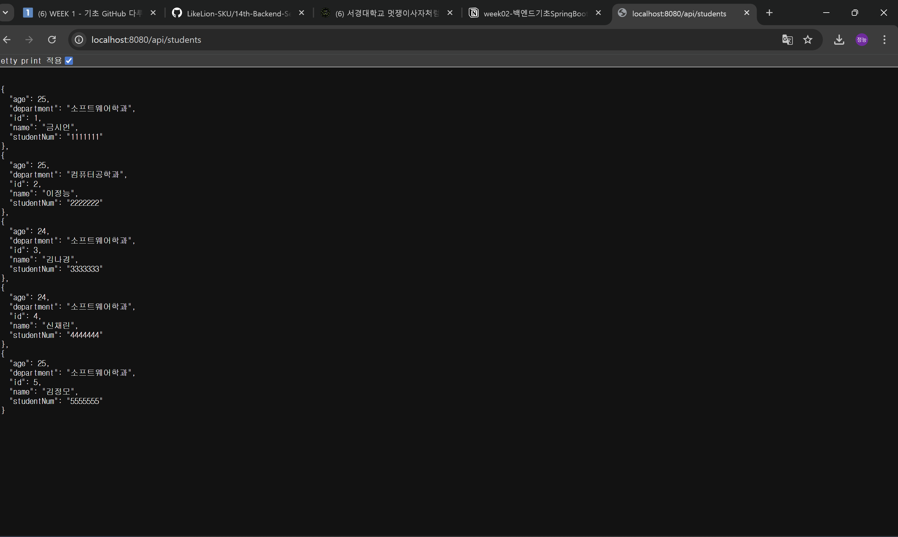

API

- Application Progam Interface

- 서로 다른 어플리케이션이 서로 소통하는데 사용되는 인터페이스

RESTful API
- Representational State Transfer 아키텍쳐를 따르는 웹 api
- 자원을 표현하고 HTTP 메서드를 사용하여 상태를 전달하는 api

- API URL 구성
  GET http://localhost:8080/api/hello
  1    2           3        4      5
1. HTTP 메소드
2. 프로토콜
3. 도메인
4. 포트번호 (스프링부트 기본 포트 8080)
5. API 엔드포인트

HTTP METHOD
- GET : 데이터 조회
- POST : 데이터 등록
- PUT : 데이터 전체 수정
- PATCH : 데이터 부분 수정
- DELETE : 데이터 삭제  

@RestController : 클래스가 REST API임을 선언
@RquestMapping : API 엔드포인틀 설정
@GetMapping : HTTP GET 요청 처리

<명령어>
./gradlew build
- 프로젝트 컴파일, .jar파일 생성

java -jar build/libs/be-session-0.0.1-SNAPSHOT.jar
-빌드된 .jar 파일을 실행하는 명령어

Gradle
-오픈 소스 빌드 자동화 도구(컴파일, 테스트, 패키징, 배포)

파일 구조 및 역할

.gradle : gradle 버전 별 엔진 및 설정
.gradle/wrapper : Gradle 설치 X gradle task 실행 가능
build.gradle : 빌드에 대한 모든 기능 정의
gradlew, gradlew.bat : Unix, Windows용 실행 스크립트
settings.gradle : 프로젝트 설정 파일

MYSQL
오픈소스 관계형 데이터베이스
테이블 : 관계형 데이터베이스 안에서 실제 데이터가 저장되는 형태

-사용 방법-
mysql -u root -p 입력 후 비밀번호 입력

<명령어>

CREATE DATABASE <데이터베이스 이름>;  : 데이터베이스 생성
USE <데이터베이스 이름>; : 사용할 데이터베이스로 이동
SHOW DATABASE; : 전체 데이터베이스 확인

-테이블 생성시
열 이름과 자료형을 지정하여 테이블을 생성함
NOT NULL : 열 값이 NULL을 가지지 못하도록 함
AUTO_INCREMENT : 열 값이 자동으로 증가하도록 설정
PRIMARY KEY (id) : 각 행을 식별하는 키, 중복X, NULL X

<테이블 명령어>
SHOW TABLES; : 데이터베이스 안 모든 테이블 조회
DESCRIBE <테이블 이름> : 테이블 정보 조회

<SQL 쿼리 문법>
INSERT INTO <테이블명> (항목) VALUES (항목 내용)
SELECT * FROM <테이블명> : 테이블에 있는 모든 데이터 조회 (id는 자동 증가)
UPDATE <테이블명> SET <항목> = 바꿀 내용 WHERE <항목> = 현재 내용 <- 테이블 내 데이터 변경
DLETE FROM <테이블명>WERE <항목> = '항목 내용' <- 데이터 삭제

<MySQL과 스프링부트 연동>
1. build.gradle 파일에서 Edit Starters 클릭
2. MySQL Driver, Spring Data JPA 의존성 추가
3. application.properties -> appilcation.yml 변경
4.  appilcation.yml 파일에 코드 작성
5. 환경변수 설정

## 실행 결과

