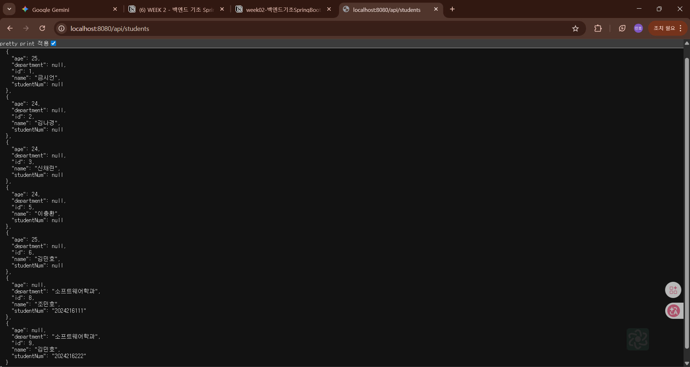

API(Application Programming Interface) :
서로 다른 어플리케이션이 서로 소통하는데 사용되는 인터페이스

동작 원리 : 클라이언트가 특정 URL로 요청을 보내면, 서버가 이를 받아 로직을 처리하고 데이터를 돌려주는 과정.

RESTful API :
Representational State Transfer 아키텍쳐를 따르는 웹 API
자원을 표현하고 HTTP 메소드를 사용하여 상태를 전달하는 API

API URL 구성 :
GET http://localhost:8080/api/hello
: HTTP 메소드 + 프로토콜 + 도메인 + 포트번호 + API 엔드포인트
추가 설명 :
프로토콜(http://)는 통신규약으로 http라는 규칙에 맞춰서 데이터를 패킷 형태로 보낸다는 것입니다.
도메인(localhost)은 컴퓨터의 주소로 원래는 IP주소이지만 사람이 읽기 쉬운 형태로 이름을 붙인 것입니다. localhost는 자신의 컴퓨터를 의미합니다.
포트번호(8080)은 컴퓨터 내의 프로그램의 번호입니다. 스프링부트는 기본적으로 8080번을 점유하고 기다립니다.
API 엔드포인트 : 서버로 들어온 뒤 어떤 클래스의 어떤 메소드를 실행할지에 대한 정보입니다.

HTTP 메소드 :
- GET : 데이터 조회
- POST : 데이터 등록
- PUT : 데이터 전체 수정
- PATCH : 데이터 부분 수정
- DELETE : 데이터 삭제

@RestController : @Controller + @ResponseBody
클래스가 REST API 컨트롤러임을 선언
@Controller는 전통적인 스프링의 컨트롤러로 클라이언트의 요청이 들어오면 비즈니스 로직 수
행 후 데이터를 받아서 html과 함께 완성된 화면을 보내줍니다.
추가 설명 :
근데 아이폰, 안드로이드 같은 스마트폰이 나오면서 HTML을 화면에 띄우는 게 아니라 데이터만을 필요로 했습니다. @ResponsetBody는 화면에 들어갈 알맹이 데이터만 보내도록 합니다.
근데 컨트롤러의 모든 메소드에 @ResponsetBody를 붙이는 건 비효율적이므로 @RestController가 생겼습니다.
근데 현재는 웹에서도 리액트나 뷰를 통해 만들어진 화면에 데이터만 넣어주는 형태가 자리잡고 있기에 @RestController를 많이 쓰게 되었습니다.

@RequestMapping :
API 엔드포인트 설정
추가 설명 :
쉽게 말해서 클래스 내의 모든 메소드들의 공통 경로를 정하는 것입니다.

@GetMapping
HTTP GET 요청을 처리
추가 설명 :
서버에 있는 자원을 변경하지 않고 오직 읽어오기만 합니다.
해당 메소드는 스프링의 핸들러 매핑이라는 지도에 등록됩니다.
만약 GET /api/hello 요청이 들어오면 /api가 적혀있는 클래스의 /hello가 적혀있는 메소드로 가서 밑의 코드를 실행하는 것입니다.

추가 설명 :
HTTP 상태 코드 : 서버는 데이터를 줄 때, 처리가 잘 됐는지에 대한 정보도 알려줍니다.
- 200 OK : 성공 (주로 GET)
- 201 Created : POST 요청 받고, 데이터 전달 성공.
- 400 Bad Request : 형식이 이상한 데이터 (예 : DB 제약조건 문제)
- 404 Not Found : 요청한 URL 주소가 없음.
- 500 Internal Server Error : 코드에서 에러가 남. (예외 처리를 잘해서 친절한 메세지로.)
  JSON : @RestController 사용 시 보내는 데이터의 규격으로 다른 언어도 읽을 수 있게 텍스트 형태를 이루고 있음.
  파라미터를 받는 법 : 어떤 데이터를 읽을지 서버에 알려주는 2가지 대표적인 방식
- @PathVariable : URL의 경로의 일부를 변수로 쓸 때 (`/api/users/1` → 1번 유저 조회)
- @RequestParam : URL 뒤에 쿼리문을 붙일 때 (`/api/users?name=minho` → 이름이 민호인 유저 조회)

Gradle 이란? :
오픈 소스 빌드 자동화 도구
프로젝트의 컴파일, 테스트, 패키징, 배포 등을 수행

빌드 도구란?
- 소스 코드를 실행 가능한 어플리케이션으로 만들어주는 도구

.gradle : gradle 버전 별 엔진 및 설정 파일
추가 설명 :
그래들이 돌아가는 실행 파일 및 이전에 빌드할 때 컴파일한 내용과 다운로드한 라이브러리를 저장합니다.
예전 빌드 기록으로 인해 새 빌드에 문제가 생기는 경우 폴더를 비우고 다시 실행해야합니다.
또한 버전이 바뀌는 경우, 예전 설정이 남아있을 수 있어 폴더를 비워야 합니다.

gradle/wrapper : Graddle을 설치하지 않아도 Gradle task를 실행할 수 있게 함.
추가 설명 :
해당 폴더에는 그래들을 실행하는 jar 실행파일과 어떤 버전의 그래들을 어디서 다운로드할지 적혀있는 설정파일이 있습니다.
해당 폴더로 인해 다른 컴퓨터에서 버전 문제가 생기지 않을 수 있습니다.
그래들 버전을 올리는 경우, 손을 대야 합니다.

build.gradle : 의존성, 플러그인 설정 등 빌드에 대한 모든 기능 정의
추가 설명 :
소스 코드가 실행 가능한 파일이 되기 위해 필요한 규칙과 라이브러리의 집합입니다.
plugins는 프로젝트의 정체성을 설정하고
dependencies는 프로젝트의 실행파일에 필요한 외부라이브러리들을 넣어줍니다.
repository는 어느 저장소에서 데이터를 가져올지 정합니다.

gradlew & gradlew.bat : Unix & Windows용 실행 스크립트
추가 설명 :
gradlew는 Unix, Mac용 실행 스크립트입니다.
gradlew.bat는 Window용 실행 스크립트입니다.
이들은 내 컴퓨터에 그래들이 없어도 원하는 버전을 가져와서 실행해줍니다.

settings.gradle : 프로젝트 설정 파일
추가 설명 : 프로젝트의 이름, 어떤 폴더들을 빌드에 포함시킬지 결정합니다.

<명령어>
./gradlew build - 프로젝트 컴파일, jar파일 생성
java -jar build/libs/be-session-0.0.1-SNAPSHOT.jar -빌드된 .jar 파일을 실행하는 명령어

결론적으로 빌드 대상을 정한 후, 플러그인과 의존성 등을 확인한 후 없으면 다운로드하고 컴파일하고 테스트합니다. 그리고 결과물이 만들어지면 실행파일이 만들어집니다.

MySQL이란?
전세계적으로 널리 사용되는 오픈소스 관계형 데이터베이스

테이블이란?
관계형 데이터베이스 안에서 실제로 데이터가 저장되는 형태
- 릴레이션 스키마 : 표의 구조
- 릴레이션 인스턴스 : 실제 데이터
- 도메인 : 값의 허용 범위
- Attribute(열) : 세로 한 줄
- Tuple(행) : 가로 한 줄

mysql -u root -p : mysql에 접속
추가 설명 :
root(관리자)유저로서 비밀번호를 입력하고 들어가겠다는 뜻입니다.

MySQL 실습 :
- CREATE DATABASE likelion; : likelion이라는 데이터베이스 생성
- USE likelion; : 사용할 데이터베이스 생성
- SHOW DATABASES; : 모든 데이터베이스 확인 가능
- CREATE TABLE student (열 이름, 자료형)
    - NOT NULL : 해당 열이 NULL값을 가지지 않도록 함.
    - AUTO_INCREMENT : 열 값 자동 증가
    - SHOW TABLES; : 데이터베이스 안 모든 테이블 조회
    - DESCRIBE student; : student 테이블 정보 조회
    - INSERT INTO student (name, age) VALUES ('금시언', 25); 데이터 삽입
    - SELECT * FROM student; : 테이블의 모든 데이터 조회
    - UPDATE student SET name=’김나경’ WHERE name=’김나겸’; : 수정
    - ELETE FROM student WHERE name=”이멋사”; 데이터 삭제

MySQL과 SpringBoot 연동
- Edit Starters 클릭해서 의존성을 추사
- MySQL Driver과 Spring Data JPA 추가
- application.yml 설정
- 환경변수 설정

