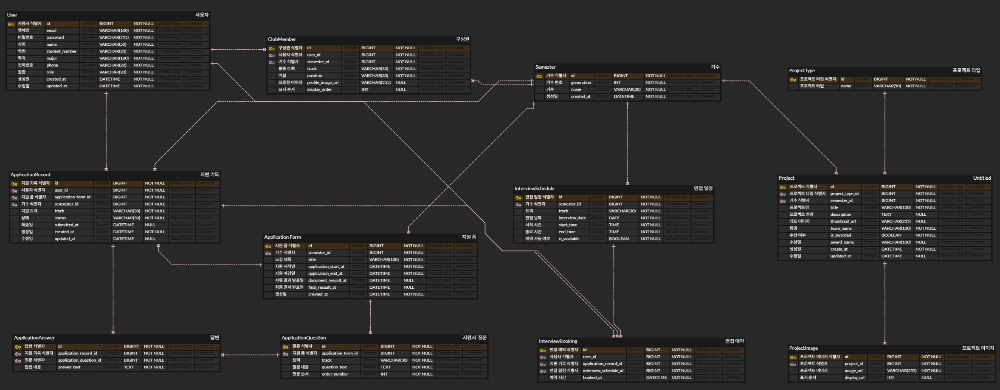

# 🗄️ 관계형 데이터베이스와 ERD 정리

---

## 🧱 관계형 데이터베이스(RDB)

- 데이터를 행과 열로 구성하는 데이터베이스 유형
- 데이터를 테이블 형태로 저장
- 열 : 데이터의 속성
- 행 : 실제 데이터 값
- 모든 테이블은 기본키를 가짐
- 외래키를 통해 테이블 간 관계 형성

---

### ✅ 관계형 데이터베이스의 장점

- 직관적인 데이터 구조
- 데이터 무결성 보장
- SQL 기반 데이터 조회
- 데이터 정규화 지원
- ACID 트랜잭션 지원

---

### 🔗 연관 관계

- 객체 지향 프로그래밍 → 객체가 다른 객체를 참조
- 관계형 데이터베이스 → 테이블 간 외래키로 연결
- ORM 기술을 사용하여 객체와 테이블 사이를 매핑

---

### 📌 연관 관계 정의 규칙

- 방향
    - 단방향
    - 양방향
- 연관 관계 주인
    - 양방향 연관 관계에서 외래키를 관리하는 주체
- 다중성
    - 엔티티 간 관계에서 한 객체가 다른 객체와 몇 개의 관계를 가질 수 있는지를 나타내는 개념

---

### 🧭 연관 관계 방향

- 관계형 데이터베이스
    - 외래키를 통해 양쪽 테이블 조인
    - 방향 개념 X
- 객체 지향 프로그래밍
    - 참조 필드가 있는 객체만 접근 가능
    - 단방향/양방향 연관 관계

---

### ➡️ 단방향 연관 관계

- 한쪽 엔티티만 다른 엔티티를 참고하는 구조
- 참조 필드가 있는 객체만 다른 객체 접근 가능

---

### 🔁 양방향 연관 관계

- 양쪽 엔티티가 서로를 참조하는 구조
- 양방향으로 객체 탐색 가능

---

### 👑 연관 관계의 주인

- 양방향 연관 관계에서는 객체에서는 참조가 2개 존재하지만, DB의 외래 키는 1개만 존재
- 주인
    - 외래키 등록/ 수정/ 삭제 가능
    - @JoinColumn 사용
    - 외래키가 있는 테이블이 주인
    - 1:N , N:1 관계에선 N쪽이 외래키를 가짐
- 주인 X
    - 읽기만 가능
    - mappedBy 사용

---

### ⚠️ OneToMany 지양 이유

- 불필요한 조회 가능성
- 객체 상태 관리 부담
- 실제 연관관계 주인은 따로 존재

→ ManyToOne 중심으로 설계, 필요 시 Query 조회 방식

---

### 🚚 Fetch Type

- 연관된 데이터를 DB에서 언제 조회할지 결정
- Eager Loading → 미리 가져옴
- Lazy Loading → 필요할 때 가져옴

---

### ⚡ Eager Loading(즉시 로딩)

- 엔티티 조회 시, 연관된 데이터까지 DB에서 함께 조회
- 장점
    - 연관 데이터 추가 조회 없이 바로 사용 가능
- 단점
    - 조인 쿼리가 복잡해짐, 성능 저하 발생
    - 조회 X 데이터까지 DB에서 가져옴

---

### 💤 Lazy Loading

- 연관된 데이터를 실제로 사용하는 시점에  DB에서 조회
- 장점
    - 불필요한 DB 조회 방지 → 처음 프록시 객체로 조회, 접근 시  DB쿼리 실행
    - 쿼리 최적화 및 성능 유리

→ JPA에서는 성능 최적화를 위해 지연 로딩 권장

---

### 🔢 다중성

- 엔티티 간 관계에서 한 객체가 다른 객체와 몇 개의 관계를 가질 수 있는지를 의미
- 다대일(N:1)
    - 여러개의 객체가 하나의 객체를 참조하는 관계
    - @ManyToOne
- 일대다(1:N)
    - 하나의 객체가 여러 개의 객체를 참조하는 관계
    - @OneToMany
- 일대일(1:1)
    - 하나의 객체가 다른 하나의 객체만 연결되는 관계
    - @OneToOne
- 다대다(N:M)
    - 여러 개의 객체가 여러 개의 객체와 연결되는 관계
    - @ManyToMany

---

### 🔀 다대다(N:M)

- 객체 지향 프로그래밍에서는 다대다 관계 직접 표현 가능
- 관계형 데이터베이스에서는 표현 불가능

→ 중간 테이블을 생성하여 일대다와 다대일을 관계로 분리해 구현

---

### 🌊 Cascade

- 부모 엔티티의 영속성 작업을 연관된 자식 엔티티에 전파
- 부모 엔티티 변경 → 자식 엔티티도 함께 처리
- 연관 엔티티 개별적으로 관리X
- 코드 간결, 유지보수 쉬워짐
- ALL
    - 모든 영속성 작업을 자식 엔티티에 전파
- PERSIST
    - 부모 엔티티 저장 시 자식 엔티티도 함께 저장
- MERGE
    - 부모 엔티티 병합 시 자식 엔티티도 병합
- REMOVE
    - 부모 엔티티 삭제 시 자식 엔티티도 삭제
- REFRESH
    - 부모 엔티티 다시 조회 시 자식 엔티티도 갱신
- DETACH
    - 부모 엔티티를 영속성 컨텍스트에서 분리 시 자식 엔티티도 분리
- 사용시 주의사항
    - 연관된 엔티티의 생명주기를 함께 관리할 때만 사용
    - 부모 엔티티와 강하게 의존하는 관계에서 사용함
    - 의도하지 않은 데이터 삭제나 수정이 발생할 수 있음

---

### 🗑️ orphanRemoval

- 부모 엔티티와 연관 관계가 끊어진 자식 엔티티를 DB에서 자동으로 삭제

---

## 🧩 ERD

- 데이터베이스 구조와 과계를 시각적으로 표현한 다이어그램
- Entity, Attribute, Relationship으로 구성
- 데이터 중복 줄임, 구조 명확 설계, 협업 시 도움됨
- Domain
    - 데이터의 의미를 표현하는 논리적인 데이터 타입
- Type
    - 실제 DB에 저장되는 물리적 데이터 타입

---

### 🐬 MySQL Workbench

- MySQL 데이터베이스를 관리하기 위한 GUI 기반 도구
- SQL 작성 후 실행하며 결과 확인 가능
- CSV 파일 Import/Export 기능 제공
- ERD 생성 및 시각적 구조 확인 가능

---

### ☁️ ERD Cloud

- ERD를 작성할 수 있는 웹 기반 다이어그램 도구
- 웹에서 바로 사용
- 무료 사용
- 실시간 협업 가능
- ERD 기반 SQL 쿼리문 생성 기능

---

### 🔐 Identifying VS Non-Identifying

- 식별 관계
    - 부모 테이블 기본키를 자식 테이블에서 기본키로 사용
    - 자식은 부모 없이 존재 X
    - 데이터 정합성 ⬆️
- 비식별 관계
    - 부모 테이블의 기본키를 자식 테이블에서 외래키로 사용
    - 자식 독립적으로 존재 가능
    - 구조 변경 유연

---

## ⚠️ ERD 작성 시 주의해야 할 제약조건

- 각 테이블은 행을 고유하게 구분할 수 있는 기본키를 가져야 함
- 테이블 간 관계가 있을 때는 자식 테이블에 외래키를 둬서 부모 테이블을 참조하게 해야 함
- 반드시 입력되어야 하는 컬럼에는 NOT NULL을 걸어야 함
- 중복되면 안되는 값에는 UNIQUE 설정을 해야 함
- 값을 입력하지 않았을 때 자동으로 들어갈 기본값을 정해야함 ‘DEFAULT’
- 컬럼에 들어갈 수 있는 값의 범위를 제한 함 ‘CHECK’
- 두 테이블이 어떤 관계인지 정확히 표현해야 함
- 부모 테이블의 기본키가 자식 테이블의 기본키에 포함 되는 지 확인
- 부모 데이터가 삭제, 수정 될 때 자식 데이터 처리 방법 정해야 함
- 같은 정보를 여러 테이블에 반복 저장 X
- 컬럼과 데이터 타입을 적절히 지정

---

## 🦁 내가 생각한 멋사 페이지([skulikelion.com](http://skulikelion.com/)) ERD

