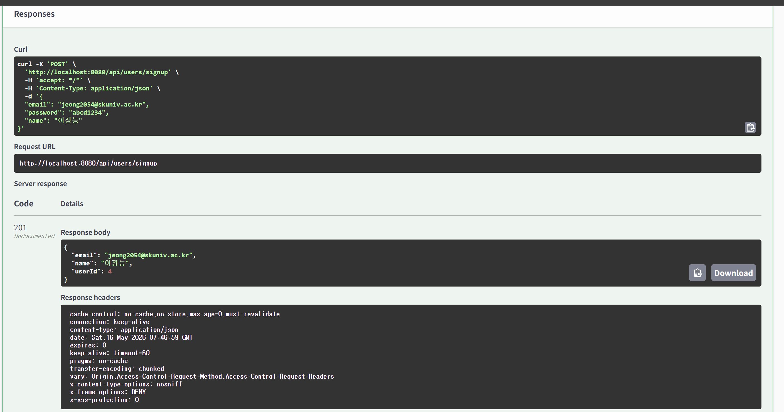
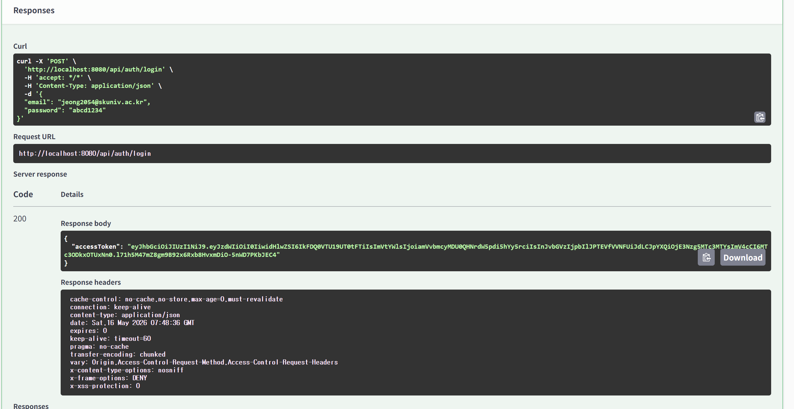

## 7주차 세션 내용 요약
# 🔐 인증과 인가

## ✅ 인증(Authentication) - 신원 확인

## ✅ 인가(Authorization) - 권한 검증

---

## 🛡️ Spring Security

- Spring에서 인증과 인가를 처리해주는 보안 프레임 워크

---

## 🔄 Spring Security 인증 처리 과정

1. 클라이언트 로그인 요청
2. AuthenticationFilter가 UsernamePasswordAuthenticationToken 생성
3. AuthenticationFIlter가 AuthenticationManger에게 인증 요청
4. AutheticationManger가 AuthenticationProvider중 Provider에게 위임
5. AuthenticationProvider가 UserDetailsService 호출 → DB에서 사용자 정보 조회
6. UserDetailsService가 UserDetails 반환
7. UserDetailsService가 사용자 정보를 Provider에게 반환
8. 인증 성공 결과를 AuthenticationManager에게 반환
9. uthenticationManager가 인증 결과를 Filter에게 반환
10. AuthenticationFilter가 인증된 사용자 정보를 SecurityContextHolder에 저장

---

## 🌐 CSRF & CORS

- CSRF : 사용자가 원하지 않은 요청이 대신 전송되는 공격 방어
- CORS : 다른 출처가 API를 호출할 수 있는지 정하는 정책

---

## 🪪 JWT(JSON Web Token)

### Flow

1. 로그인 성공
2. 서버가 JWT 발급
3. 클라이언트 JWT 저장
4. 이후 요청마다 JWT를 함께 전송
5. 서버가 JWT를 검증하고 사용자 식별

### 구조

- Header
    - 어떠한 알고리즘으로 암호화 할 것인지, 어떠한 토큰을 사용할 것 인지에 대한 정보
- Payload
    - claim이라고 부르는 전달하려는 정보 인코딩 된 내용
- Signature
    - Header 와 Payload를 기반으로 Secret Key를 사용해 서명 생성, 토큰을 받을 때 다시 서명 검증

---

## 🔑 Access Token & Refresh Token

- JWT 하나만 사용시 편의성과 보안 사이에서 문제 발생

### Access Token

- API에 접근하기 위한 출입증

### Refresh Token

- Access Token을 다시 발급받기 위한 토큰

---

## ⚙️ JWT의 동작 원리

1. 클라이언트가 서버에 로그인 요청
2. 아이디와 비밀번호가 맞다면 access token, refresh token생성
3. 서버가 클라이언트에 토큰들 전달
4. 사용자의 로컬 스토리지에 저장
5. 클라이언트가 서버 헤더에 access token 담아서 request
6. access token 검증
7. 서버가 클라이언트에 response 전송

---

## 🚨 Token 설계 시 보안 고려사항

- Access Token 만료 시간 짧게 설정
- Refresh Token은 서버에서 관리
- 로그아웃 시 Refresh Token 삭제
- 토큰에는 민감한 정보를 넣지 않기
- Secret Key는 안전하게 관리
- HTTPS 사용

---

## 📁 auth 따로 구분 이유

- 사용자 정보 관리와 인증 처리는 책임이 다름
- 회원가입 : 새로운 사용자 생성
- 로그인 : 이미 존재하는 사용자가 맞는지 확인/Access Token 발급

## 회원가입

## 로그인
