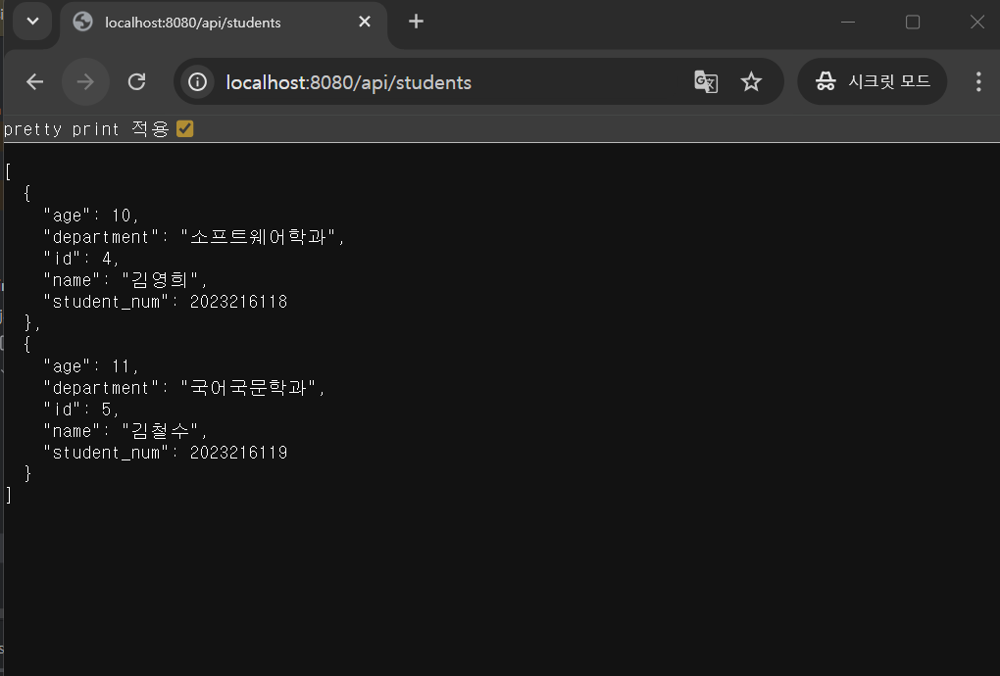
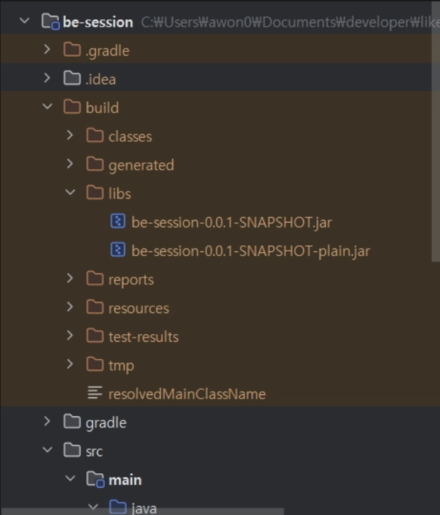
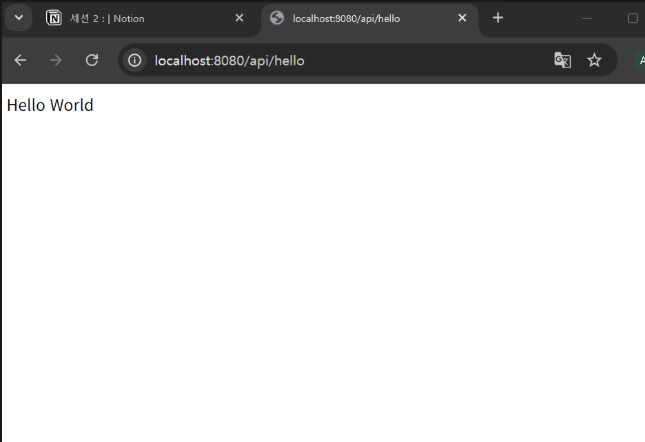
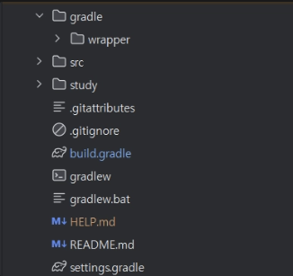

# [ Session02 ] 백엔드 기초 SpringBoot의 이해

---
- Session02 과제
- 

## 🫠 일반 프로그램 vs 자바 프로그램

---

- 일반 프로그램→ OS에 종속적
    - 소스 코드를 특정 OS가 알아듣는 기계어로 바로 번역
- Java프로그램 → OS에 독립적
    - 소스코드를 바이트코드(`.class`)라는 중간 단계로 번역
    - JVM(Java Virtual Machine)라는 가상 머신 위에서 해당 OS에 맞는 기계어로 변환
- 자바 컴파일과 실행

    ```yaml
    자바 소스코드(.java) —(자바컴파일러)—>바이트 코드(.class)—> JVM 머신
    ```


## 🫠 Spring vs SpringBoot

---

- Spring : Java기반 웹 프레임워크
    - 복잡한 설정
        - `.war` 배포 : 별도 WAS 서버 설치 및 설정 필요( ex Tomcat)
- 스프링부트 : Spring을 쉽게 사용하기 위한 프레임워크
    - 간단한 설정 :
        - `.jar` 배포 : 내장 웹 서버 Tomcat 사용
        - 자동 설정 :`@SpringBootApplication` 어노테이션 하나로 수많은 기본 설정 완료
        - Starter의존성 : `spring-boot-starter-web`처럼 필요한 기능을 묶음(Starter)으로 제공

## 🫠 MVC 패턴

---

- MVC 패턴

  관심사 분리 → 유지보수성을 편하게 하기 위함

    - Model : 모델
    - View : 화면
    - Controller : Model -View 연결

- SpringBoot MVC 패턴

  스프링 부트 아키텍처에서는 MVC를 어떻게 하나 → ✨시험!!

  스프링부트에서는 MVC를 더 세분화하여 사용, 각 계층은 “단일 책임 원칙”에 따름

    ```yaml
    웹 브라우저 —(요청)—> 내장 서버(Tomcat) —> Controller → Service → Repositroy—> DB
    
                         ←—————————(응답)———————————l
    ```

    - Controller : 요청(HTTP Request) 받고 응답(Response) 보내기
    - Service : 비즈니스 로직 처리
    - Repository : DB 접근하여 데이터 처리
    - Entity : DB와 1:1 매핑되는 데이터 객체

## 🫠 패키지 구조

---

- 계층형 패키지 구조 ( m,v,c대로 나누기)
    - `controller/`: UserController, BoardController
    - `service/`: UserService, BoardService
    - `repository/`: UserRepository, BoardRepository
    - `domain/`: User, Board (Entity)
- 도메인형 패키지 구조 (도메인별로 디렉토리 구분)
    - 여기서 도메인이란, 특정 속성,특징,기능의 대분류
    - `user/`: UserController, UserService, UserRepository, User (Entity)
    - `schedule/`: ScheduleController, ScheduleService, ...
    - `workspace/`: WorkspaceController, …
    - → 정말 완벽히 연결성을 없애면, MSA로 나뉠 수 있다!

## 🫠 명명 규칙

---

팀끼리 컨벤션을 정하고 간다, 하지만 자바는 명확히 규칙이 있다

- camelCase : 변수,메서드 (userAge)
- PascalCase : 클래스,타입 (UserService)
- SNAKE_CASE : 상수명 (MAX_USERS)

## 🫠 API

---

사용자의 요청과 요청에 대한 응답은 어떻게 이루어질까? → API

API : 서로 다른 어플리케이션이 소통하는데 사용되는 인터페이스

RESTful API : REST(Representational State Transfer )아키텍처를 따르는 웹 API

- RESTful API URL 구성
    - HTTP 메소드
    - 프로토콜
    - 도메인
    - 포트번호 (스프링은 기본 8080)
    - API 엔드포인트
- HTTP 메소드 → 시헙!!
    - GET : 데이터 조회
    - POST : 데이터 등록
    - PUT : 데이터 전체 수정
    - PATCH : 데이터 부분 수정
    - DELETE : 데이터 삭제

## 🫠 실습

---

- `com.likeion.besession > HelloController` 클래스 만들기

```java
@RestController
@RequestMapping("api")
public class HelloController {
    @GetMapping("/hello")
    public String hello(){
        return "Hello World";
    }
}

```

- RestController : RESTAPI 클래스 임을 명시(Controller + ResponseBody)

```java
// 실제 내부 코드 (Ctrl+클릭 으로 볼 수 있음!)

  // IntelliJ API Decompiler stub source generated from a class file
  // Implementation of methods is not available

package org.springframework.web.bind.annotation;

@java.lang.annotation.Target({java.lang.annotation.ElementType.TYPE, java.lang.annotation.ElementType.METHOD})
@java.lang.annotation.Retention(java.lang.annotation.RetentionPolicy.RUNTIME)
@java.lang.annotation.Documented
@org.springframework.web.bind.annotation.Mapping
@org.springframework.aot.hint.annotation.Reflective({org.springframework.web.bind.annotation.ControllerMappingReflectiveProcessor.class})
public @interface RequestMapping {
    java.lang.String name() default "";

    @org.springframework.core.annotation.AliasFor("path")
    java.lang.String[] value() default {};

    @org.springframework.core.annotation.AliasFor("value")
    java.lang.String[] path() default {};
    org.springframework.web.bind.annotation.RequestMethod[] method() default {};
    java.lang.String[] params() default {};
    java.lang.String[] headers() default {};
    java.lang.String[] consumes() default {};
    java.lang.String[] produces() default {};
    java.lang.String version() default "";
}
```

- RequestMapping : API 엔드포인트 설정
- GetMapping : HTTP GET 요청 처리

- dependency 추가

```yaml
// 프로젝트에 필요한 의존성
dependencies {
    implementation 'org.springframework.boot:spring-boot-starter-web'
 }
```

- 코끼리 버튼 꼭 눌러서 의존성 추가하기!!

🤔 `spring-boot-starter-web`이란?

→ `spring-boot-starter-web`은 스프링 부트로 웹 애플리케이션(REST API, MVC 등)을 개발할 때 필요한 모든 핵심 라이브러리

- **Spring MVC**: 웹 계층을 구성하는 핵심 프레임워크 (`DispatcherServlet`, `@Controller` 등)
- **Embedded Tomcat**: 별도의 서버 설치 없이 웹 애플리케이션을 실행할 수 있게 해주는 **내장 웹 서버**.
- **Jackson**: 자바 객체와 JSON 데이터를 서로 변환해 주는 라이브러리. (API 개발 시 필수)
- **Validation**: 데이터 유입 시 유효성 검사(예: `@NotEmpty`, `@Min`)를 위한 라이브러리.
- **Spring Boot Starter**: 스프링 부트의 기본 설정, 로깅(Logback), YAML 설정 지원 등.

- 스프링 어플리케이션 빌드 : `termnal>./gradew build`
    - 프로젝트를 컴파일하고, 실행 가능한 jar 파일을 생성
    - 소스코드 컴파일 → 테스트 실행(if 실패→ 빌드 중단) → jar 파일 생성

```
PS C:\Users\wacaw\Documents\developer\likelion_14th_spring\be-session> ./gradlew build

Welcome to Gradle 9.4.0!

Here are the highlights of this release:
 - Java 26 support
 - Non-class-based JVM tests
 - Enhanced console progress bar

For more details see https://docs.gradle.org/9.4.0/release-notes.html

Starting a Gradle Daemon, 1 incompatible Daemon could not be reused, use --status for details
Java HotSpot(TM) 64-Bit Server VM warning: Sharing is only supported for boot loader classes because bootstrap classpath has been appended

BUILD SUCCESSFUL in 22s
7 actionable tasks: 7 executed
Consider enabling configuration cache to speed up this build: https://docs.gradle.org/9.4.0/userguide/configuration_cache_enabling.html
PS C:\Users\awon0\Documents\developer\likelion_14th_spring\be-session> 

```

→ 빌드시 /build/libs 폴더에 .jar 파일이 2개 생성된걸 확인할 수 있다!

실행파일 2개 생성 ( `be-session-0.0.1-SNAPSHOT.jar`,`be-session-0.0.1-SNAPSHOT-plain.jar`)된건 뭘까? → 부가 설명

생성된 jar 파일로 Spring 어플리케이션 직접 실행

```
// 터미널에 입력 
java -jar build/libs/be-session-0.0.1-SNAPSHOT.jar 
```

```
PS C:\Users\awon0\Documents\developer\likelion_14th_spring\be-session> java -jar build/libs/be-session-0.0.1-SNAPSHOT.jar

  .   ____          _            __ _ _
 /\\ / ___'_ __ _ _(_)_ __  __ _ \ \ \ \
( ( )\___ | '_ | '_| | '_ \/ _` | \ \ \ \
 \\/  ___)| |_)| | | | | || (_| |  ) ) ) )
  '  |____| .__|_| |_|_| |_\__, | / / / /
 =========|_|==============|___/=/_/_/_/

 :: Spring Boot ::                (v4.0.4)

2026-03-31T19:18:11.708+09:00  INFO 30780 --- [be-session] [           main] c.wacaw.besession.BeSessionApplication   : Starting BeSessionApplication v0.0.1-SNAPSHOT using Java 21.
0.8 with PID 30780 (C:\Users\awon0\Documents\developer\likelion_14th_spring\be-session\build\libs\be-session-0.0.1-SNAPSHOT.jar started by awon0 in C:\Users\awon0\Documents\developer\likelion_14th_spring\be-session)
2026-03-31T19:18:11.723+09:00  INFO 30780 --- [be-session] [           main] c.wacaw.besession.BeSessionApplication   : No active profile set, falling back to 1 default profile: "default"
2026-03-31T19:18:13.187+09:00  INFO 30780 --- [be-session] [           main] o.s.boot.tomcat.TomcatWebServer          : Tomcat initialized with port 8080 (http)
2026-03-31T19:18:13.203+09:00  INFO 30780 --- [be-session] [           main] o.apache.catalina.core.StandardService   : Starting service [Tomcat]
2026-03-31T19:18:13.204+09:00  INFO 30780 --- [be-session] [           main] o.apache.catalina.core.StandardEngine    : Starting Servlet engine: [Apache Tomcat/11.0.18]
2026-03-31T19:18:13.236+09:00  INFO 30780 --- [be-session] [           main] b.w.c.s.WebApplicationContextInitializer : Root WebApplicationContext: initialization completed in 1428 ms
2026-03-31T19:18:13.783+09:00  INFO 30780 --- [be-session] [           main] o.s.boot.tomcat.TomcatWebServer          : Tomcat started on port 8080 (http) with context path '/'
2026-03-31T19:18:13.798+09:00  INFO 30780 --- [be-session] [           main] c.wacaw.besession.BeSessionApplication   : Started BeSessionApplication in 2.729 seconds (process running for 3.742)

```



웹 브라우저에 get 요청을 날려서 반환을 받음

## 🫠 Gradle이란?

---

:  Kotlin 언어를 기반으로 한 오픈소스 빌드 자동화 도구, 프로젝트의 생명주기를 관리하는 핵심 엔진이

- 빌드란 : 실행 가능한 어플리케이션으로 전환하는 것!



- 설정 언어(DSL)
    - **Groovy DSL (`build.gradle`)**:
        - 전통적인 방식
        - 문법이 자유롭고 유연하지만 자동 완성 기능이 다소 약함
    - **Kotlin DSL (`build.gradle.kts`)**:
        - 최신 트렌드
        - 정적 타이핑을 지원하여 IDE의 자동 완성 및 컴파일 체크가 강력함

- Gradle 파일 구조 및 역할
    - `.gradle` : gradle 버전 별 엔진 및 설정파일
    - `gradle/wrapper` :Gradle을 설치하지 않아도 Gradle task를 실행할 수 있게 함
        - 내부 `gradle-wrapper.properties` 파일 :

        ```
        // Gradle은 매번 다운로드하지 않고 로컬 환경에 캐싱
        distributionBase=GRADLE_USER_HOME
        distributionPath=wrapper/dists
        // Gradle의 정확한 버전과 다운로드 경로를 지정
        distributionUrl=https\://services.gradle.org/distributions/gradle-9.4.0-bin.zip
        // 안정성 설정
        networkTimeout=10000
        validateDistributionUrl=true
        zipStoreBase=GRADLE_USER_HOME
        zipStorePath=wrapper/dists
        
        ```

    - `build.gradle`: "무엇을(의존성)", "어떻게(플러그인)" 빌드할지 정의
        - **Plugins**: `id 'org.springframework.boot'`와 같이 필요한 기능을 확장
        - **Repositories** : 빌드에 필요한 의존성 다운받을 저장소
        - Dependencies: 실제 사용하는 라이브러리 선언

        ```
        // 환경 기본 플러그인 설정
        plugins {
            id 'java'
            id 'org.springframework.boot' version '4.0.4'
            id 'io.spring.dependency-management' version '1.1.7'
        }
        
        // 옵션
        group = 'com.example'
        version = '0.0.1-SNAPSHOT'
        description = 'be-session'
        
        // 자바 버전 설정
        java {
            toolchain {
                languageVersion = JavaLanguageVersion.of(21)
            }
        }
        
        // 빌드에 필요한 의존성 다운받을 저장소
        repositories {
            mavenCentral()
        }
        
        // 프로젝트에 필요한 의존성
        dependencies {
            implementation 'org.springframework.boot:spring-boot-starter-web'
            implementation 'org.springframework.boot:spring-boot-starter-data-jpa'
            testImplementation 'org.springframework.boot:spring-boot-starter-test'
            runtimeOnly 'com.mysql:mysql-connector-j'
            testRuntimeOnly 'org.junit.platform:junit-platform-launcher'
        }
        
        //JUnit 5 기반 테스트
        tasks.named('test') {
            useJUnitPlatform()
        }
        
        ```

    - `gradlew & gradlew.bat`: Unix & Windows용 gradle 실행 스크립트
        - 이 스크립트들은 내부적으로 `gradle-wrapper.jar`를 실행
    - `settings.gradle`: 프로젝트 설정 파일
        - 초기화 단계 : Gradle이 빌드를 시작할 때 가장 먼저 읽는 파일로, 프로젝트 이름(`rootProject.name`)을 여기서 정의
        - 멀티 모듈 구성 : 대규모 프로젝트에서 여러 개의 서브 프로젝트를 하나로 묶을 때 사용된다
            - ex ) `include 'api-module','common-module', 'batch-module’`

## 🫠 데이터베이스

---

: 체계적으로 구조화된 데이터의 집합으로 여러 사람들과 공유하고 동시 접근하며 관리할 수 있는 저장소

- 데이터 베이스 분류
    - 관계형 DB : 표 형식으로 데이터를 관리하며, 테이블간 관계를 정의해 사용
    - 비관계형 DB :
        - key-value DB,  그래프 DB(노드-간선), 문서 지향 DB (JSON)

그 중, 관계형 DB의 대표적인 오픈소스 관계형 데이터베이스 MySQL으로 실습한다

- 터미널 창에서 MySQL 서버에 로그인 : `mysql -u root -p`

```
PS C:\Users\awon0\Documents\developer\likelion_14th_spring\be-session> mysql -u root -p
Enter password: ****
Welcome to the MySQL monitor.  Commands end with ; or \g.
Your MySQL connection id is 13
Server version: 8.0.42 MySQL Community Server - GPL

Copyright (c) 2000, 2025, Oracle and/or its affiliates.

Oracle is a registered trademark of Oracle Corporation and/or its
affiliates. Other names may be trademarks of their respective
owners.

Type 'help;' or '\h' for help. Type '\c' to clear the current input statement.

```

- 데이터 베이스 언어(SQL문)

```sql
// DB 생성
CREATE DATABASE likelion; // 데이터베이스 생성
USE likelion; // 사용할 데이터베이스로 이동

// DB 조회
SHOW DATABASES; // 모든 데이터베이스 확인

// 테이블 생성 
CREATE TABLE student (
	id bigint AUTO_INCREMENT PRIMARY KEY, // AUTO_INCREMENT : 열 값이 자동으로 증가하도록 설정
	name VARCHAR(10) NOT NULL, 
	age int
	);
	
// 테이블 조회
SHOW TABLES; // 데이터베이스 안 모든 테이블 조회
DESCRIBE student; // student 테이블 정보 조회

// 데이터 삽입
INSERT INTO student (name, age) VALUES ('kim', 23);
INSERT INTO student (name, age) VALUES ('choi', 24);
INSERT INTO student (name, age) VALUES ('Lee', 24);

// 데이터 조회
SELECT * FROM student; // 테이블에 있는 모든 데이터 조회

// 데이터 수정
UPDATE student SET name='kim-2' WHERE name='kim';
UPDATE student SET age=20 WHERE id=1;

// 데이터 삭제
DELETE FROM student WHERE name='최아원';
```

- SQL문이 대문자인 이유 : 가독성 향상 (예약어와 사용자 정의 데이터의 구분)
    - **구분 안 함**: `select name from users where age > 20;`
    - **구분 함**: `SELECT name FROM users WHERE age > 20;`->가독성 up

## 🫠 MySQL과 SpringBoot 연동

---

- 의존성 추가 : `org.springframework.boot:spring-boot-starter-web` 으로 변경

```sql
// 프로젝트에 필요한 의존성
dependencies {
    implementation 'org.springframework.boot:spring-boot-starter-web'
    implementation 'org.springframework.boot:spring-boot-starter-data-jpa'
    testImplementation 'org.springframework.boot:spring-boot-starter-test'
    runtimeOnly 'com.mysql:mysql-connector-j'
    testRuntimeOnly 'org.junit.platform:junit-platform-launcher'
}
```

- MySQL Driver : MySQL 통역사
    - `runtimeOnly 'com.mysql:mysql-connector-j'`
- Spring Data JPA : 자바 객체만으로 DB 다루는 도구 모음
    - `implementation 'org.springframework.boot:spring-boot-starter-data-jpa'`

- `build > resources > main > [application.propertie](http://application.properties)s→ application.yml` 설정

```yaml
spring:
  application:
    name: be-session

datasource:
  url: jdbc:mysql://localhost::3306/LikeLion?serverTimezone=UTC&characterEncoding=UTF-8
  username: root
  password: ${DB_PASSWORD}
  driver-class-name: com.mysql.cj.jdbc.Driver

```

- Student Entity 작성

```java
package com.wacaw.besession.domain.student.entity;

import jakarta.persistence.Entity;
import jakarta.persistence.GeneratedValue;
import jakarta.persistence.GenerationType;
import jakarta.persistence.Id;

@Entity
public class Student {

    @Id
    @GeneratedValue(strategy = GenerationType.IDENTITY)
    private Long id;
    private String name;
    private Integer age;
    private String department;
    private Integer student_num;

    public Long getId() {
        return id;
    }

    public String getName() {
        return name;
    }

    public Integer getAge() {
        return age;
    }

    public Integer getStudent_num() {
        return student_num;
    }

    public String getDepartment() {
        return department;
    }
}

```

- StudentRepository

```java
public interface StudentRepository extends JpaRepository<Student, Long> {
}
```

- StudentController

```java
@RestController
@RequestMapping("/api")
public class StudentController {

    private final StudentRepository studentRepository;

    public StudentController(StudentRepository studentRepository) {
        this.studentRepository = studentRepository;
    }

    @GetMapping("/students")
    public List<Student> findAll(){
        return studentRepository.findAll();
    }
}

```

