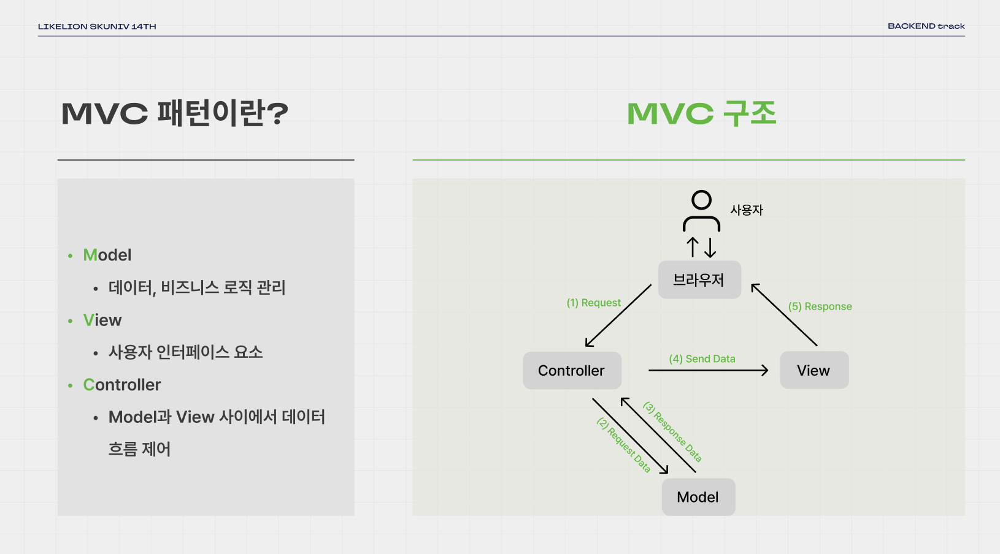
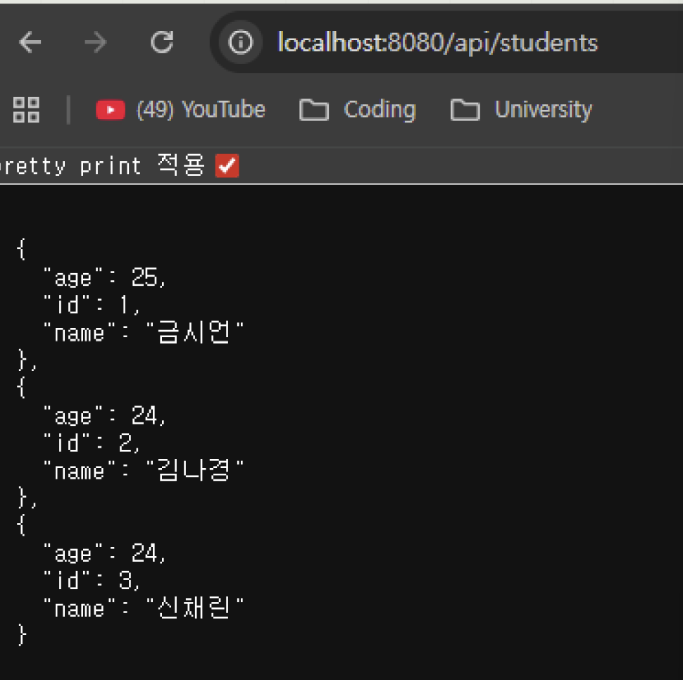
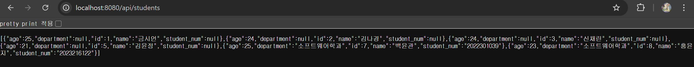

## 백엔드 2주차 세션 정리
* * *
> "SpringBoot의 개념과 실습에 대하여."
> -김현수-
### 1. Java는 알고 넘어가자!
- C, C++, Python 등의 프로그램은 OS(운영체제)에 종속됩니다.
- Java는 이와 달리, OS에 종속되지 않는데요.
  - OS와 프로그램 사이에 JVM이라는 가상 머신이 OS에 종속되지 않게 개별적으로 프로그램을 짤 수 있게 합니다.
- .java 파일은 java 컴파일러를 통해 .class 파일로 변환 -> JVM에 의해 바이트 코드를 각 OS에 맞게 실행해줍니다!
* * *
### 2. SpringBoot, 그래서 너 뭔데?
>"Spring을 쉽게 사용하기 위해 제가 탄생하였습니다." -SpringBoot-
#### vs Spring
- SpringBoot는 Spring과 다르게 초기 설정과 의존성 관리가 편한데요.
- 특히, 내장 웹 서버인 Tomcat을 자동으로 제공해준답니다!
* * *
### 2.1 SpringBoot Architecture, 바로 알아봅시다!
>"MVC 구조가 중요한데요.. 백엔드가 어떤 일을 하는 지부터 알아야 합니다." -SpringBoot Architecture-
#### 여기서 잠깐, MVC 구조는 이런 겁니다!

- 사용자가 보는 화면에서의 처리와 사용자가 보이지 않는 곳에서의 데이터 처리 등을 패턴화하는 구조를 의미하는데요.
- 여기서, 백엔드의 역할은 이미지 상에서는 Controller와 Model 간의 구조를 다룬다고 보시면 됩니다.
- 이 구조에 맞춰서 SpringBoot 아키텍처 역시 이해할 수 있는데요.
#### SpringBoot Architecture에 대하여
- 일렬로 살펴보자면 웹브라우저 -> Tomcat(내장서버) -> Controller -> Service -> Repository -> DB 요런 식으로 데이터 간 계층적으로 전달하게 됩니다.
- 사용자에게 받은 응답의 처리 과정은 역순으로 진행되겠죠?
* * *
### 2.2 패키지 구조
> "계층형 패키지와 도메인 패키지의 웅장한 싸움이 시작되었다는데요···"
#### 계층형 패키지 구조
- 각 계층을 기준으로 디렉토리를 구분합니다.
- 장점:
  - 프로젝트의 전체적인 구조를 파악하는데에 탁월합니다.
- 단점:
  - 하지만, 디렉토리별로 클래스가 많아지면··· 보기 불편합니다.
#### 도메인 패키지 구조
- 도메인을 기준으로 디렉토리를 구분합니다.
- 장점:
  - 기능별로 독립적인 구조를 유지하는데에 용이합니다.
- 단점:
  - 프로젝트 이해도가 낮으면 전체적인 구조를 파악하는데에 어렵습니다.
### 3. 프로그래밍 명명 규칙
#### camelCase: 첫 단어의 첫 글자는 소문자, 다음 단어부터 첫 글자는 대문자
#### PascalCase: 모든 단의 첫 글자는 대문자
#### SNAKE_CASE: 모든 단어의 문자가 소문자 or 대문자

* * *

### 4. API
>  "사용자의 요청과 요청에 대한 응답은 어떻게 이루어질까요?"
#### RESTful API
- 서로 다른 어플리케이션이 서로 소통하는데 사용되는 인터페이스
- 자원을 표현하고 HTTP 메서드를 사용하여 상태를 전달하는 API입니다.
#### URL 구성
ex) GET http://localhost:8080/api/hello
순서대로 HTTP 메소드/프로토콜/도메인/포트번호/API 엔드포인트를 의미합니다!
#### HTTP 메소드
- GET: 데이터 조회
- POST: 데이터 등록
- PUT: 데이터 전체 수정
- PATCH: 데이터 부분 수정
- DELETE: 데이터 삭제

* * *
### 5. Gradle에 대하여
- 오픈 소스 빌드 자동화 도구인데요!
- 프로젝트의 컴파일, 테스트, 패키징, 배포 등을 수행합니다.
#### Gradle 파일 구조
- .gradle: gradle 버전 별 엔진 및 설정 파일
- gradle/wrapper: Gradle을 설치하지 않아도 Gradle task를 실행할 수 있게 함
- build.gradle: 의존성, 플러그인 설정 등 빌드에 대한 모든 기능 정의
- gradlew & gradlew.bat: Unix & Windows용 실행 스크립트
- settings.gradle: 프로젝트 설정 파일

#### 빌드 자동화
- `./gradlew build` -> 컴파일 + 테스트 + jar 생성
#### 의존성 관리
- `dependencies {
  implementation 'org.springframework.boot:spring-boot-starter-web'
}`
-> 라이브러리를 다운로드하고 필요한 하위 라이브러리를 자동으로 연결해줍니다.

* * *
### 6. MySQL에 대하여
>"우선, 데이터베이스부터 알아봅시다!"
#### 데이터베이스란?
- 전자적으로 저장된 데이터의 집합입니다.
- 단어, 숫자, 이미지 등 다양한 유형의 데이터가 저장될 수 있습니다.

#### 관계형 데이터베이스 vs 비관계형 데이터베이스

#### 6.1 관계형 데이터베이스
- 구조적인 데이터 저장 방식
- 스키마에 맞게 데이터를 입력해야 합니다.
- MySQL, PostgreSQL 등이 해당됩니다!

#### 6.2 비관계형 데이터베이스
- 유연한 데이터 저장 방식
- Key-Value, Graph 등 다양한 형식으로 데이터를 저장합니다.
- MongoDB, Redis 등이 해당됩니다!

### 6.3 MySQL이란?
- 전세계적으로 가장 널리 사용되고 있는 오픈소스 관계형 데이터베이스

#### 테이블
- 관계형 데이터베이스 안에서 실제 데이터가 저장되는 형태를 의미합니다.

### 6.4 MySQL 실습
#### `mysql -u root -p` 명렁어 입력 후 설정된 비밀번호 입력
#### `CREATE DATABASE likelion;`: 데이터베이스 생성
#### `USE likelion;`: 해당 likelion 데이터베이스로 이동
#### `SHOW DATABASES;`: 모든 데이터베이스 확인 가능
#### `CREATE TABLE student ( id bigint AUTO_INCREMENT PRIMARY KEY,name VARCHAR(10) NOT NULL, age int);` : 열 이름과 자료형을 지정하여 테이블 생성
- NOT NULL: 해당 열이 NULL 값을 가지지 않도록 설정
- AUTO_INCREMENT: 열 값이 자동으로 증가하도록 설정
- PRIMARY KEY (id): 각 행을 식별하는 키, 중복 허용X, NULL 값을 가질 수 없음
#### `SHOW TABLES`: 데이터베이스 안 모든 테이블 조회
#### `DESCRIBE student`: student 테이블 정보 조회
#### 데이터 삽입 및 조회
:`INSERT INTO student (name, age) VALUES ('금시언', 25); `
- id 칼럼이 있기 때문에 칼럼을 명시해야 하죠!

: `SELECT * FROM student;`

- 테이블에 있는 모든 데이터 조회
- id 칼럼은 자동으로 증가합니다!

#### 데이터 수정
:`UPDATE student SET name='김나경' WHERE name='김나겸';`
- WHERE을 사용하여 수정하려는 데이터 지정

#### 데이터 삭제
:`DELETE FROM student WHERE name="이멋사";`
- WHERE을 사용하여 삭제하려는 데이터 지정

* * *
### 7. MySQL과 SpringBoot 연동
- 의존성을 추가해줍니다.
- MySQL Driver, Spring Data JPA
- applicatuon.yml을 설정해줍니다.
- 환경변수를 설정해줍니다. -> {DB_PASSWORD=본인 비밀번호}

***
### 8. 부트로 조회 실습
#### Controller, Entity, Repository 파일을 생성해줍니다!
#### 프로젝트 실행 후 해당 api 접속 시 MySQL에 저장된 데이터 조회가 가능합니다

***
### 2주차 과제 제출
>"관련 localhost:8080/api/students 스크린샷 이미지 첨부합니다!"
> 

