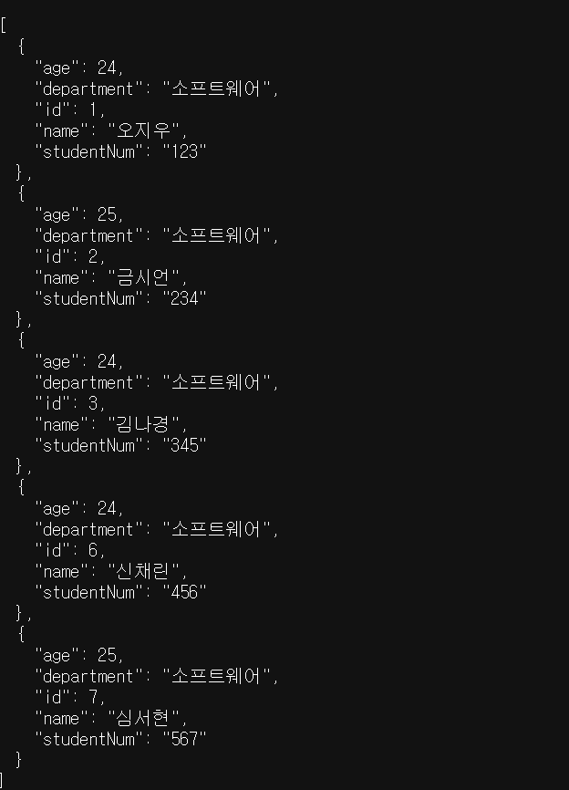

JAVA는 일반 프로그램과 달리 OS에 독립적이며 JVM위에서 운영됨

|        | Spring | Spring Boot |
|--------|----------|---------------|
| 정의     | Java 기반 웹 프레임워크 | Spring을 쉽게 사용하기 위한 프레임워크 |
| 초기 설정  | 복잡함 | 자동 설정 제공 |
| 의존성 관리 | 직접 관리 | 자동 관리 (Starter) |
| 서버     | 별도 서버 필요 (WAR 배포) | 내장 서버 제공 (JAR 실행) |

> Spring Boot는 Spring의 복잡한 설정을 자동화하여 개발 생산성을 높인 프레임워크

### MVC 패턴

- **Model** : 데이터, 비즈니스 로직 관리
- **View** : 사용자 인터페이스 요소
- **Controller** : Model과 View 사이에서 데이터 흐름 제어
```md
  Client → Controller → Service → Repository → DB
               ↓
             View
```
## 🌱SpringBoot Architecture


웹 브라우저  <-`DTO`->  Tomcat  <-`DTO`->  Controller  <-`DTO`->  Service  <-`DTO`->  Repository  <-`Entity`->  DataBase
- DTO는 Request와 Response로 나뉨
- Reqeust DTO: 클라이언트 -> 서버로 보내는(요청하는) 데이터
- Response DTO : 서버 -> 클라이언트로 응답하는 데이터

### 계층형 패키지 구조

각 계층을 기준으로 디렉토리 구분

- 프로젝트 전체 구조 빠르게 파악 가능
- 디렉토리 내 클래스가 많이 보여 불편

### 도메인형 패키지 구조

도메인을 기준으로 디렉토리 구분

- 기능별로 독립적인 구조 유지
- 프로젝트 이해도가 낮을 시 전체적 구조 파악 어려움

### 프로그래밍 명명 규칙

| camelCase | PascalCase | SNAKE_CASE |
|:---------:|:----------:|:----------:|
| 변수 | 클래스 | 상수 |

[ 자바와 DB의 변수 이름 규칙 ]

- Java: camelCase (ex. studentNum)
- DB: snake_case (ex. student_num)

둘의 이름을 다르게 만들어도 Spring Boot는 기본적으로 이름 변환 전략이 적용되어 있어서 
studentNum → student_num으로 DB와 자동 매핑이 됨. 그러나 @Column을 작성해 확실히 매핑해주는 것이 안전함.


## Request & Response

### API

- 서로 다른 어플리케이션이 서로 소통하는데 사용되는 인터페이스(Application Programming Interface)

### RESTful API

- Representational State Transfer 아키텍처를 따르는 웹 API : 하나의 고유한 리소스를 대표하도록 설계된다는 의미
- 자원을 표현하고 HTTP 메서드를 사용하여 상태를 전달하는 API

## API URL 구성

#### GET  http://localhost:8080/api/hello

- HTTP 메소드 : GET/POST/PUT/PATCH/DELETE
  - GET : 리소스 조회, POST : 리소스 생성, PUT : 리소스 전체 수정, PATCH : 리소스 부분 수정, DELETE: 리소스 삭제 
  - GET vs POST
  - GET은 URL에 데이터를 포함해서 쿼리 파라미터로 전달. POST는 RequestBody에 데이터를 담아서 보내기때문에 URL에 데이터 안보임
  - PUT vs PATCH
  - PUT은 기존 데이터를 덮어쓰기 때문에 필드를 채우지 않으면 null값이 됨. 
  - PATCH는 필요한 필드만 수정 가능
- http : 프로토콜 (통신방식)
  - http는 암호화X, https는 암호화O
- localhost : 도메인(서버주소. localhost는 내 컴퓨터)
- 8080  : 포트번호(스프링부트 기본 포트 8080 | 80 -> http | 443 -> https)
- api/hello : API 엔드포인트
> HTTP는 메소드의 행위, URI는 자원을 표현하는 것

### HelloController

1. `@RestController` = `@Controller` + `@ResponseBody` : 클래스가 REST API 컨트롤러임을 선언
2. `@RequestMapping` : API 엔드포인트 설정
3. `@GetMapping` : HTTP GET 요청 처리

----
### Gradle

- 오픈 소스 **빌드 자동화 도구** (소스 코드를 실행 가능한 어플리케이션으로 만들어주는 도구)
- 프로젝트 컴파일, 테스트, 패키징, 배포 등 수행


`.gradle` : gradle 버전 별 엔진 및 설정 파일

`gradle/wrapper` : Gradle을 설치하지 않아도 Gradle task를 실행할 수 있게 함

`build.gradle` : 의존성, 플러그인 설정 등 빌드에 대한 모든 기능 정의

`gradlew & gradlew.bat` : Unix & Windows용 실행 스크립트

`settings.gradle` : 프로젝트 설정 파일

``` java
plugins {
    id 'java'
    id 'org.springframework.boot' version '4.0.5'               //→ 환경 구성에 필요한 플러그인 설정
    id 'io.spring.dependency-management' version '1.1.7'
}
group = 'com.likelion'
version = '0.0.1-SNAPSHOT'                                  //→ 옵션 (groupId, 어플리케이션 버전 등)
description = 'be-session'
java {
    toolchain {
    languageVersion = JavaLanguageVersion.of(21)               //→ Java 버전 설정
    }
}
repositories {
    mavenCentral()                                              //→ 빌드에 필요한 의존성을 다운받을 저장소
}
dependencies {
    implementation 'org.springframework.boot:spring-boot-starter-web'
    implementation 'org.springframework.boot:spring-boot-starter-data-jpa' //→ 프로젝트에 필요한 의존성 설정
    testImplementation 'org.springframework.boot:spring-boot-starter-test'
    runtimeOnly 'com.mysql:mysql-connector-j'
    testRuntimeOnly 'org.junit.platform:junit-platform-launcher'
}
tasks.named('test') {
    useJUnitPlatform()                                          // → Junit 5 기반 테스트 실행
}
```
----
# DataBase

- 전자적으로 저장된 데이터의 집합
- 여러 사람들과 데이터 공용 가능
- 다양한 유형의 데이터 저장 가능

#### 관계형 데이터베이스

- 구조적인 데이터 저장 방식
- 데이터를 테이블 형식으로 저장
- 스키마에 맞게 데이터 입력
- SQL 언어 사용
- MySQL, PostgreSQL 등

#### 비관계형 데이터베이스

- 유연한 데이터 저장 방식
- Key-Value, Graph 등 다양한 형식으로 데이터 저장
- 스키마에 따라 데이터 읽어옴
- DBMS마다 사용 언어 다름
- MongoDB, Redis 등

#### MySQL

전세계적으로 가장 널리 사용되고 있는 오픈 소스 관계형 데이터베이스

#### 테이블

관계형 데이터베이스 안에서 실제 데이터가 저장되는 형태

**mySQL 간단 문법 정리**

mysql 접속> `mysql -u root -p`

```sql
CREATE DATABASE likelion;
USE likelion;
SHOW DATABASES;

CREATE TABLE student(
	id bigint AUTO_INCREMENT PRIMARY KEY, --각 행을 식별하는 키, 열 값 자동 증가, 중복 허용X, NOT NULL 
	name VARCHAR(10) NOT NULL,     --해당 열이 null값을 가지지 않도록 설정
	age int
	);
	
SHOW TABLES;
DESCRIBE student;   -> DESC student;    --테이블 정보 조회

INSERT INTO student(name, age) VALUES ('오지th', 25);  
SELECT * FROM student;
UPDATE student SET name = '오지수' WHERE name = '오지th';
UPDATE student SET age = 24 WHERE id = 1;
DELETE FROM student WHERE id = 1;
```

## SQL 과제
```sql
-- student_num 컬럼 추가
mysql> ALTER TABLE student ADD COLUMN student_num VARCHAR(20) NOT NULL;

-- department 컬럼 추가
mysql> ALTER TABLE student
  -> ADD COLUMN department VARCHAR(100) NOT NULL;

mysql> UPDATE student 
    -> SET department = '소프트웨어'
    -> WHERE id IN (1,2,3);

mysql> update student set student_num = '123' where id = 1;
mysql> update student set student_num = '234' where id = 2;
mysql> update student set student_num = '345' where id = 3;

mysql> ALTER TABLE student                                   
    -> MODIFY COLUMN student_num INT;

mysql> insert into student(name, age, student_num, department) values ('신채린', 24, 456, '소프트웨어');

mysql> insert into student(name, age, student_num, department) values ('심서현', 25, 567, '소프트웨어'); 

mysql> select * from student;
+----+--------+------+-------------+------------+
| id | name   | age  | student_num | department |
+----+--------+------+-------------+------------+
|  1 | 오지우 |   24 |         123 | 소프트웨어 |
|  2 | 금시언 |   25 |         234 | 소프트웨어 |
|  3 | 김나경 |   24 |         345 | 소프트웨어 |
|  6 | 신채린 |   24 |         456 | 소프트웨어 |
|  7 | 심서현 |   25 |         567 | 소프트웨어 |
+----+--------+------+-------------+------------+

```

---

### ⁉️ 학번 타입 — `String` vs `Integer`

| 타입 | 사용하는 경우 |
|------|-------------|
| `String` | 값을 계산하지 않고 그대로 보존하거나 식별하는 용도 |
| `Integer` | 값의 크기 비교나 연산이 필요한 경우 |

> **학번은 `String` 추천!**
> 학번 맨 앞자리가 `0`일 경우, `Integer`에 저장하면 숫자로 인식되어 앞의 `0`이 자동으로 사라지고 원래 형식을 잃어버리게 됨

---

### ⁉️ Entity 타입 — `int` vs `Integer`

Entity에서는 보통 `int` 대신 `Integer`를 사용함.

DB와 연동되는 경우 값이 존재하지 않을 수 있기 때문에 `NULL`일 수 있는데,
`int`는 null을 저장할 수 없어 오류가 발생할 수 있음.

| 타입 | null 허용 | 사용 권장 |
|------|----------|----------|
| `int` | X | 비권장 (Entity) |
| `Integer` | O | 권장 (Entity) |


