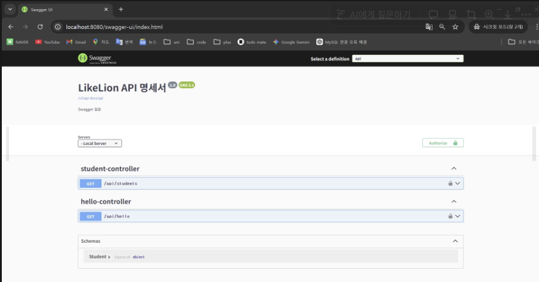

# [ Session03 ]  API 명세와 CRUD

API 설계 과정 및 API 개발 방식에 대해 알아보고, API 명세서 작성해보기

---

- Session02 과제
- https://festive-bit-4d6.notion.site/API-2b0c3911b0a38263a8ef011ba9ba8292?source=copy_link

## 🫠 API

---

API란, 소프트웨어간 데이터를 주고받기 위한 통신 규칙을 정의한 **인터페이스**

- 웹서비스 흐름

```graphql
유저 → 클라이언트(Frontend) ──── 요청 ────> 서버(Backend) → DB
                           <──── 응답 ────
```

### REST란?

그럼, API는 어떤 방식으로 API를 설계할까?

> **REST(Representational State Transfer)** : 자원을 **URI**로 표현하고, **HTTP Method**로 자원을 조작하는 HTTP 기반
> 설계 방식
>

- URL vs URI
    - I (Identifier) : 자원을 식별 문자열 (`/users/1`)
    - L (Locator): 자원의 위치 문자열  (`https://example.com/users/1`)

REST 구성

- 자원 (URL) : 데이터
- 행위 (HTTP Method) : 자원에 대한 동작
- 표현 (JSON, XML 등) : 클라이언트, 서버가데이터를 주고받는 형태 (ex JSON, XML)

REST 특징

- 클라이언트-서버 구조 : 클라이언트와 서버의 역할이 명확히 분리
- 무상태 : 서버 이전 요청을 기억하지 않음 (각 요청마다 필요한 정보를 매번 보내야 함)
- 인터페이스 일관성 : (중요) 자원은 URI, 행위는 HTTP
- 캐시 가능 : 응답 데이터를 캐시해서 로딩 시간을 줄임
- 계층 구조 : 로드 밸런서, 프록시 등 여러 서버를 중간에 배치 가능
- 자체 표현성 : 요청 응답만 보더라도 무슨 동작인지 명확하게 표현

### REST API란?

위에 있는 REST 원칙을 따르는 API )

```
클라이언트 ──── GET / POST / PATCH / DELETE ────> REST API ────> 서버
```

>
>
>
> RestAPI vs Restful API
>
> - RestAPI : 원칙을 따르는 API
> - Restful API : REST 원칙을 **충실히** 잘 지킨 API
>
> 즉, REST의 원리를 충실히 잘 따르는 시스템을 “RESTful”이란 용어로 지칭
>

## 🫠 CRUD와 HTTP메서드

---

그래서 RestAPI 이게 어떻게 쓰는데?

> REST는 URI와 HTTP Method를 통해 CRUD를 수행하는 설계 방식이다
>

```
자원 (URI) + 행위 (HTTP Method) = REST API
```

예를 들어, 사용자 정보를 다루는 API를 REST 방식은 다음과 같다

| 동작        | HTTP Method | URI           |
|-----------|-------------|---------------|
| 사용자 목록 조회 | `GET`       | `/users`      |
| 특정 사용자 조회 | `GET`       | `/users/{id}` |
| 사용자 생성    | `POST`      | `/users`      |
| 사용자 정보 수정 | `PATCH`     | `/users/{id}` |
| 사용자 삭제    | `DELETE`    | `/users/{id}` |

CRUD 기본 구조

| 작업         | HTTP Method     | Spring 어노테이션                    | 설명     |
|------------|-----------------|---------------------------------|--------|
| **C**reate | `POST`          | `@PostMapping`                  | 데이터 생성 |
| **R**ead   | `GET`           | `@GetMapping`                   | 데이터 조회 |
| **U**pdate | `PUT` / `PATCH` | `@PutMapping` / `@PatchMapping` | 데이터 수정 |
| **D**elete | `DELETE`        | `@DeleteMapping`                | 데이터 삭제 |

- Create : POST (생성)

    ```java
    @RestController           // 이 클래스가 REST API를 처리하는 컨트롤러임을 선언
    @RequestMapping("/posts") // 클래스 레벨 공통 경로(prefix) 설정
    public class PostController {
    
        @PostMapping("/create") // 메서드 레벨 세부 경로 설정
        public String createPost() {
            // 최종 경로: /posts/create
            return "게시글 생성 완료";
        }
    }
    ```

    - 클래스 레벨 경로 + 메서드 레벨 경로가 합쳐져 최종 URI이 된다
      예: `/posts`(prefix) + `/create` → `/posts/create`
- Read : GET ( 조회)

    ```java
    @GetMapping("/list")
        public String getPostList() {
            return "전체 게시글 목록 반환";
        }
    ```

- Update : PUT / PATCH (수정)

  두 가지 메서드가 있고, 핵심 차이는 **멱등성(Idempotency)!
  여기서,** 멱등하다 = 여러 번 호출해도 서버의 상태가 처음 한 번 호출했을 때와 같다는 뜻

    - PATCH : PatchMapping (부분 수정) - 멱등하지 않음

        ```java
        @PatchMapping("/{id}")
            public String updatePostPartially(@PathVariable Long id) {
                // 비즈니스 로직: id에 해당하는 게시글의 '조회수'만 올리거나 '제목'만 변경
                return id + "번 게시글 부분 수정 완료 (멱등성 보장되지 않을 수 있음)";
            }
        ```

    - PUT : PutMapping (전체 수정) - 멱등함

        ```java
        @PutMapping("/{id}")
            public String updatePostAll(@PathVariable Long id) {
                // 비즈니스 로직: id에 해당하는 게시글의 제목, 내용, 작성자 등을 통째로 교체
                return id + "번 게시글 전체 수정 완료 (멱등성 보장)";
            }
        ```

    - HTTP에서 멱등성이 필요한 이유

      결제 요청이 네트워크 오류로 끊겼을 때 재시도하면?

      PATCH (멱등 X) → 재시도할 때마다 만원씩 추가 결제
      PUT  (멱등 O) → 몇 번 재시도해도 "결제 완료" 상태로 고정

- Delete : DELETE
    - soft Delete : DB에서 직접 삭제 X (접근을 못하게 만듦)
        - 복구/이력/참조무결성 문제 완화
    - hard Delete : DB에서 직접 삭제 O
        - 저장공간 확보/참조 관계 문제 가능
    - 참조무결성 문제?
        - **참조 무결성**이란 "참조하는 놈이 있으면 참조당하는 놈도 반드시 존재해야 한다"는 규칙

## 🫠 REST 설계 원칙

---

- RESTful URI (엔드포인트) 설계 원칙
    - ✨ 명사 사용
    - 복수형 사용
    - ✨ 계층구조 표현
    - 마지막 슬레시 사용x
    - 소문자 사용
    - 확장자 포함 X
- REST는 왜 관계중심 URL를 사용할까
    - 자원 중심 설계 : URI는 “무엇을 할까”가 아니라 “어떤 자원인가”를 표현
    - URI는 자원의 식별자 : URI는 데이터를 찾기 위한 주소
    - ✨ 확장성과 재사용성
    - ✨ URI와 HTTP 메소드 역할 분리

## 🫠 API 명세서란

---

왜 필요해? 소통/일관성 유지/유지보수

- API 명세서 작성 시기
  :  AI 기능 명세가 나오고, 와이어 프레임이 나오면, 그걸 보고 백엔드가 API 명세서를 작성
  - API 명세서 작성 방법

  → API 명세서 구글 노션 템플릿(무료사용) https://www.notion.com/ko/templates/api-base

    1. 기본 정보 작성 :
        - API 이름: API의 기능과 목적을 간단히 설명
        - 버전: API의 현재 버전 (예: v1, v2)
        - Base URL: API의 기본 주소
    2. 인증 방식 명시
        - Basic Auth: 아이디/비밀번호 기반 인증
        - Bearer Token: 토큰 기반 인증
        - API Key: 고유 키로 인증
        - OAuth: 외부 서비스 기반 인증 (소셜 로그인)
    3. Endpoint와 HTTP 메서드 작성
        - Endpoint URI
        - HTTP 메서드
        - 설명 : 해당 API 기능과 목적
    4. 각 Endpoint에 대한 요청 Parameter
        - 경로(PathVariable): /stores/{storeId} → 특정 자원을 식별할 때 사용
        - 쿼리(ReqeustParam) : ?keyword=value → 검색/필터/페이지네이션 등 추가 조건 전달
        - 헤더(RequestHeader) : 인증정보나 요청 설정 전달
        - 본문(RequestBody) : JSON 형식 데이터
    5. API가 반환하는 응답 구조
        - 응답 형식: 주로 JSON 형식으로 작성
        - 상태 코드: 200 OK / 201 Created / 404 Not Found 등
        - 응답 예시: 실제 응답 데이터의 예시
    6. API 사용 중 발생할 수 있는 오류 상황과 대응 방법을 명시
        - 상태 코드: 400 - Bad Request, 401 - Unauthorized, 500 - Internal Server Error
        - 오류 메세지 형식: 오류 발생 시 반환되는 JSON 메세지의 형식과 예시 작성
- API 문서화 도구
    - Swagger/ POSTMAN/ GitBook

## 🫠 API 구현

---

- 객체 생성 방식
    - Java의 객체 생성 방식
        - new 키워드를 사용해 객체 생성 (일한 객체를 여러 번 생성 → 메모리 낭비)
    - Spring의 객체 생성 방식
        - Spring Container가 대신 생성 및 관리
            - Bean 객체 : 스프링이 관리하는 객체
            - 싱글톤으로 관리 : 객체는 단 하나만 생성,공유
- Bean 등록 방법
    - 수동 등록 :`@Configuration` + `@Bean` 메서드를 통해 직접 Bean으로 등록
    - 자동 등록: 특정 Annotation(@Component, @Service, @Controller)이 붙은 클래스는 Spring이 컴포넌트 스캔을 통해 자동으로
      Bean으 등록

> 컴포넌트 스캔이란? → @을 붙여놓으면, 이걸 자동으로 스캔한다
>

- DI 의존성 주입
    - 필요한 객체를 직접 생성하지 않고, 스프링이 대신 주입해주는 방식 (객체 간 결합도 감소)

> Bean은 Spring이 관리하는 객체이고, DI는 그 Bean을 필요한 곳에 주입해주는 방식이다
>

- Bean 주입 방식
    1. 생성자 주입(가장권장) : 생성자를 통해 필요한 객체 전달받음

        ```java
        @Component
        public class PostService {
        
            private final PostRepository postRepository;
        
            @Autowired // 생성자를 통해 Spring이 Bean을 주입
            public PostService(PostRepository postRepository) {
                this.postRepository = postRepository;
            }
        }
        ```

        - @Compponent : 스프링이 관리하는 빈으로 등록하겠다
        - @Autowired : 게임 빈을 생성하려고 할때, 생성자에 넣어줌
        - final 키워드 사용가능 → 불변성 보장 O
    2. 필드 주입

        ```java
        @Component
        public class PostService {
        
            @Autowired
            private PostRepository postRepository; // 불변성 보장 X
        }
        ```

        - 필드에 직접 @Autowired을 사용
        - `final` 키워드 사용 불가 → 불변성을 보장 X → 안정성 깨질 수 있다
    3. Setter 주입

        ```java
        @Component
        public class PostService {
        
            private PostRepository postRepository;
        
            @Autowired
            public void setPostRepository(PostRepository postRepository) {
                this.postRepository = postRepository;
            }
        }
        ```

        - Setter 메서드를 사용하여 의존 객체 주입받음
        - 의존성 객체가 선택적이거나, 나중에 변경될 가능성이 있을 때 사용

## 🫠 주요 어노테이션

- Annotation : 코드에 의미와 동작을 부여하는 기능, 메타데이터
    - 스프링은 어노테이션을 통해 객체를 생성-연결-관리 한다
    - @Component → 자동 Bean 등록 (해당 클래스를 자동으로 Bean으로 등록)
    - @Configuration → 설정 클래스 (Bean 설정을 정의하는 클래스임을 표시)
    - @Bean → 수동 Bean 등록 (메서드를 통해 객체를 직접 Bean으로 등록)
    - @Transactional → 트랜잭션 처리 (여러 DB 작업을 하나로 묶어 모두 성공하거나 모두 실패하도록 처리)
    - @Value → 외부 설정 값 주입 (application.yml / properties 값을 코드에 주입)

- Lombok Annotation : 반복되늰 코드를 자동으로 생성해주는 라이브러리
    - Getter : 값 조회, getter 메서드 자동 생성
    - Setter : 값 수정, setter 메서드 자동 생성
    - Builder : 객체 생성시 값을 하나씩 설정

        ```kotlin
        Person.builder()
        	.name("Adam Savage")
        	.city("San Francisco")
        	.job("Mythbusters")
        	.job("Unchained Reaction")
        	.build();
        ```

    - NoArgsConstructor :  인자가 없는 기본 생성자 자동 생성
    - AllArgsConstructor :  모든 인자를 받는 생성자 자동 생성
    - RequiredArgsConstructor : 필수 인자(`final`필드나`@NonNull`어노테이션이 붙은 필드)에 대한 생성자를 자동으로 생성
    - Transactional : 모두 성공/모두 실패 → 일관성 유지
        - ACID : 원자성/일관성(돈 송금-받음)/격리성(트랜잭션은 서로 독립적)/지속성 (결과 저장)

## 🫠 실습

---

- 의존성 추가

```kotlin
// swagger openapi-ui
implementation 'org.springdoc:springdoc-openapi-starter-webmvc-ui:2.8.1'
```

- swagger 클래스 추가 → import 주의

```kotlin
package com.wacaw.besession.global.config;

import io.swagger.v3.oas.models.Components;
import io.swagger.v3.oas.models.OpenAPI;
import io.swagger.v3.oas.models.info.Info;
import io.swagger.v3.oas.models.security.SecurityRequirement;
import io.swagger.v3.oas.models.security.SecurityScheme;
import io.swagger.v3.oas.models.servers.Server;
import org.springdoc.core.models.GroupedOpenApi;
import org.springframework.beans.factory.annotation.Value;
import org.springframework.context.annotation.Bean;
import org.springframework.context.annotation.Configuration;

@Configuration // Spring이 클래스의 Bean들을 관리함 (설정 클래스 등록)
public class SwaggerConfig {

    @Value("${server.servlet.context - path:}") //외부 설정 파일값 가져오기 
    private String contextPath;

    @Bean // 메서드의 반환 객체를 Spring Bean으로 등록
    public OpenAPI customOpenAPI()
    {

        // Swagger에서 사용할 서버 정보 설정 
        Server localServer = new Server();
        localServer.setUrl(contextPath);
        localServer.setDescription("Local Server");

        // API 명세를 정의하는 객체
        return new OpenAPI ()
            .addServersItem(localServer) // 서버 정보 설정 
            .addSecurityItem(new SecurityRequirement ().addList("bearerAuth"))
            .components(
                new Components ().addSecuritySchemes(
                    "bearerAuth",
                    new SecurityScheme ()
                        .type(SecurityScheme.Type.HTTP)
                        .scheme("bearer") // JWT 인증을 사용할수 있도록 설정
                        .bearerFormat("JWT")
                )
            )
            // API 전체 정보 설정
            .info(new Info ().title("LikeLion API 명세서").version("1.0").description("Swagger 실습"));
    }

    @Bean // OpemAPI 설정 객체 Bean으로 등록 
    public GroupedOpenApi customGroupedOpenApi()
    {
        // 모든 API를 api 그룳으로 묶어서 관리 
        return GroupedOpenApi.builder().group("api").pathsToMatch("/**").build();
    }
}

```

http://localhost:8080/swagger-ui/index.html 주소 접속시, Swagger는 Controller를 기반으로 문서를 자동 생성



### Q. 위에 실습의 swagger 코드말고도 swagger 사용 방법이 더 있나?

→ 참고하기 좋은 블로그 : https://happybplus.tistory.com/1057#google_vignette

특히 여기서 보안설정 부분과, 공통 응답 포맷(Success/Fail) 부분이 중요하다고 생각했다

### Q. 어노테이션에도 정해놓은 규칙/순서가 있을까?

→ 어노테이션 붙이는 순서는 상관 없이, 동작은 동일하게 정상 수행된다
다만, 가독성과 실무 관례상@Operation → @GetMapping 순서로 작성하는 것이 일반적

(멘토님의 조언) Settings > Code Style에서 GoogleStyle 사용
