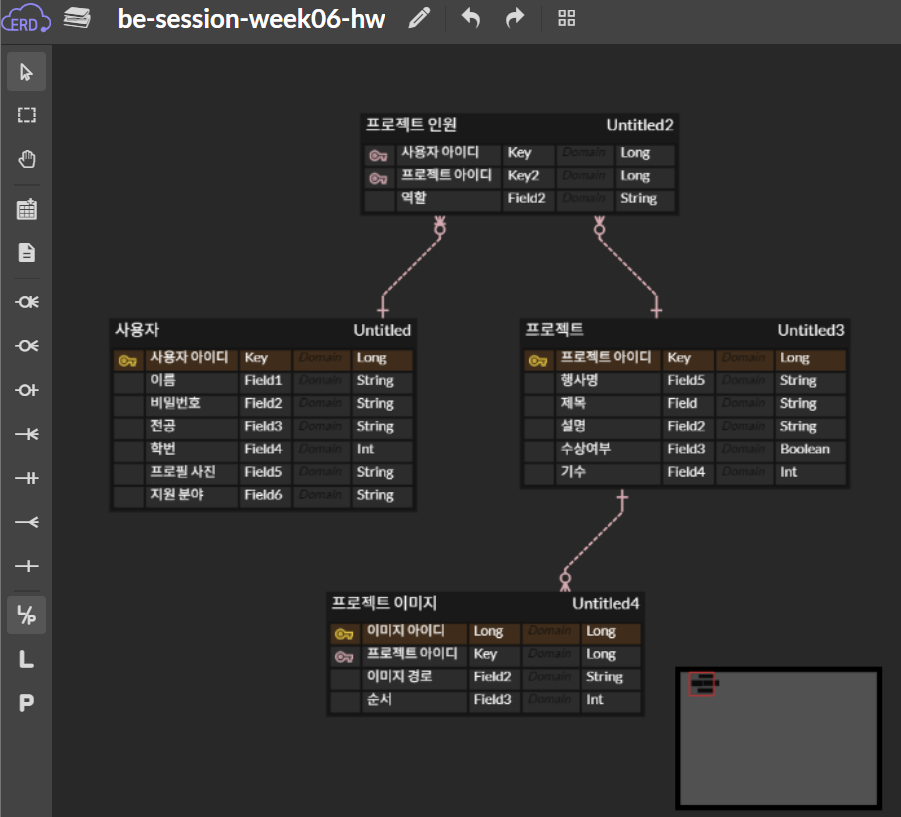

## 🫠 RDB 관계형 데이터베이스

---

- 정의
    - 열과 행으로 이루어진, 테이블 형태로 저장
    - 테이블간 관계를 통해 연결된다 (키본키와 외래키)
- 관계형 DB 이점
    - 직관적
    - SQL 기반 데이터 조회
    - 데이터 무결성(데이터가 정확하고 일관되게 유지되는 성질)
    - (중요) 데이터 정규화 지원(데이터 중복을 줄이고, 테이블 분리)
    - (중요) ACID 트랜젝션 지원

## 🫠 연관관계

---

- 연관관계 ⇒ ORM 기술 사용
    - 객체 지향 프로그래밍
        - 객체가 다른 객체를 참조하여 관계 형성
    - 관계형 데이터베이스
        - 테이블이 외래키로 다른 테이블과 연결
- 연관관계 정의 규칙
    - 방향
        - 기본 단방향
        - 필요할시 양방향 (ex 팀 조회↔ 멤버 조회)
    - 연관관계 주인 : 외래키를 관리하는 주체
        - 주인 : JoinColumn / 외래키 등록,수정,삭제 가능 / 1:N 관계의 N쪽이 주인
        - 주인 X : mappedBy / 읽기만 가능
    - 다중성 (1:1, 다:1 …)
- OneToMany를 지양해야하는 이유
    - 불필요한 조회
    - 객체 상태 관리 부담
    - 실제 연관관계 주인은 따로 존재하기에

  ⇒ 단방향(ManyToOne) 중심 설계, Qurery 방식이 적절

## 🫠 Fetch Type

---

: JPA에서 연관된 데이터를 DB에서 언제 조회할지 결정

- 즉시로딩 : 연관된 데이터 한꺼번에 가져옴 ( `fetch = FetchType.EAGER` )
    - 성능저하 발생 가능, 사용하지 않는 불필요한 데이터까지 함께 조회
- 지연로딩 : 실제로 연관 데이터에 접근하는 시점에 가져옴 (`fetch = FetchType.LAZY` )
    - JPA에서는 성능 최적화를 위해 지연로딩을 권장

⇒ LAZY 로딩 사용, 필요시 Fetch 조인 사용

## 🫠 다중성

---

엔티티간 한 객체가 다른 객체와 몇개의 관계를 가질 수 있는지 의미

- 다대일 (가장 많이 쓰임)
- 일대다
- 일대일
- 다대다 → DB에서는 조인 테이블을 생성해 구혀냏야함 (ex 게시글과 태그 관계)

## 🫠 Cascade

---

부모 엔티티 변경 → 자식도 같이 처리

- Cascade 타입
    - ALL
    - PERSIST
    - MERGE
    - REMOVE
    - REFRESH
    - DETACH
- orphanRemoval : 연관관계가 끊긴 자식 엔티티를 DB에서 자동으로 삭제하는 옵션
- orphanRemoval vs Cascade REMOVE
- 사용시 주의사항
    - 부모 엔티티와 강하게 의존하는 경우에만 사용
    - 의도치 않은 데이터의 삭제/수정이 발생할 수 있음

## 🫠 ERD

---

DB를 코드로 구현하기 전 시각적으로 표현하는 설계 도구

- 엔티티/속성/관계
- Domain/Type
    - Domain : 데이터의 의미
    - Type : 실제 물리적 데이터 타입

## 🫠 MySQL 워크밴치 실습하기

---

- ERD Cloude : ERD 작성 웹기반 다이어그램 도구

## 🫠 ERD를 작성할 때 주의해야 할 제약조건

---

1. 개체 무결성 : 모든 테이블은 각 행을 유일하게 식별할 수 있는 수단을 가져야 한다

- **기본키 설정:** 모든 엔티티에는 기본키가 반드시 존재해야 하며, 이는 Null 값이 될 수 없다
- **유일성:** 기본키 값은 중복될 수 없으며, 엔티티 내에서 유일해야 한다

2. 참조 무결성 : 외래키 관계를 통해 데이터 간의 일관성을 유지한다

- **유효한 참조:** 외래키 값은 참조하는 테이블의 기본키에 반드시 존재하거나, 혹은 **NULL**이어야 한다
- **연쇄 동작 설정:** 부모 데이터 삭제/수정 시 자식 데이터를 어떻게 처리할지(`CASCADE`, `SET NULL`, `RESTRICT` 등)를 명확히 정의해야 한다

3. 도메인 제약조건  : 각 속성이 가질 수 있는 값의 범위를 제한한다

- **데이터 타입:** 숫자, 문자, 날짜 등 적절한 타입을 지정해야 한다
- **기본값 및 범위:** 특정 값의 범위를 지정하거나(예: 나이는 0 이상), 값이 입력되지 않았을 때의 기본값을 설정한다

4. 관계 제약조건  : 엔티티 간의 연결 방식에 대한 논리적 제약

- **카디널리티:** 1:1, 1:N, M:N 관계를 명확히 정의한다
- **선택성:** 필수 참여인지 선택 참여인지를 구분해야 한다

5. 업무 규칙 및 기타 제약 (Business Rules)

- **고유 제약조건** 기본키는 아니지만 중복을 허용하지 않는 속성(예: 이메일, 전화번호)을 정의한다
- **Check 제약조건:** 논리적으로 타당한 값인지 검증한다

